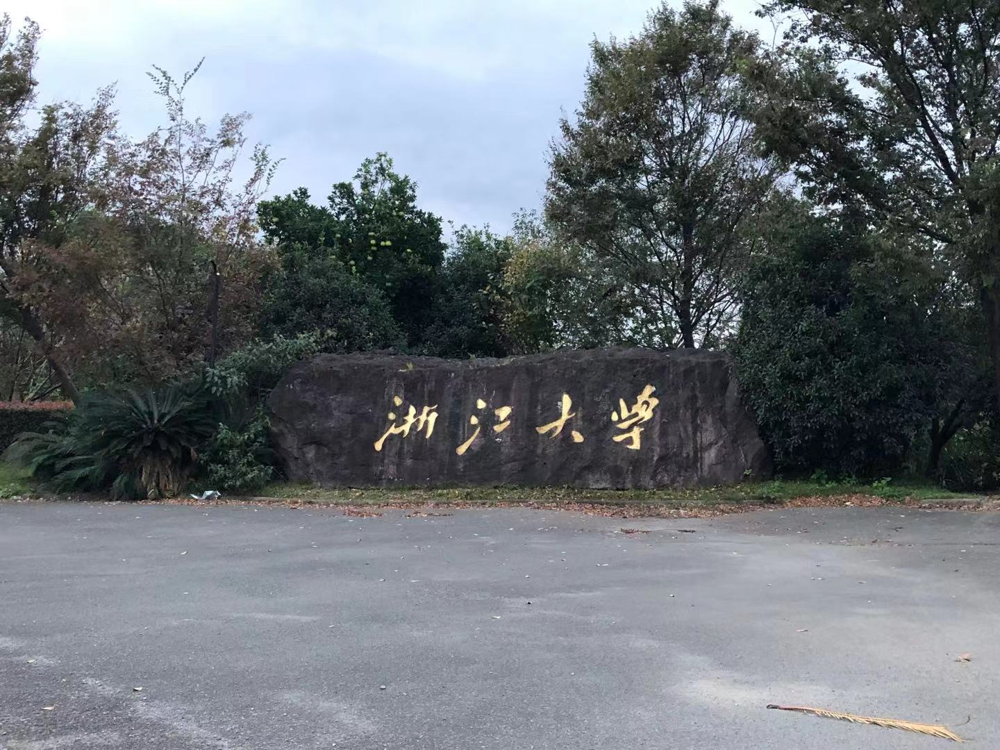
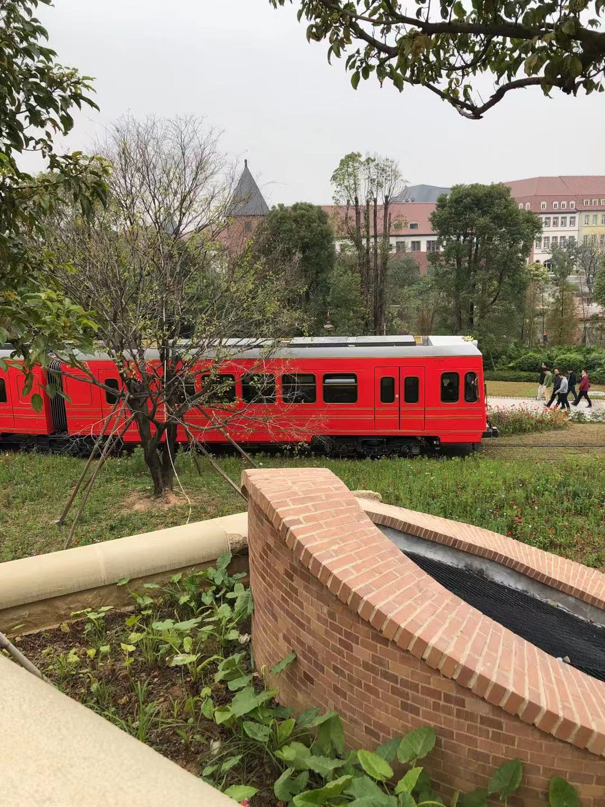
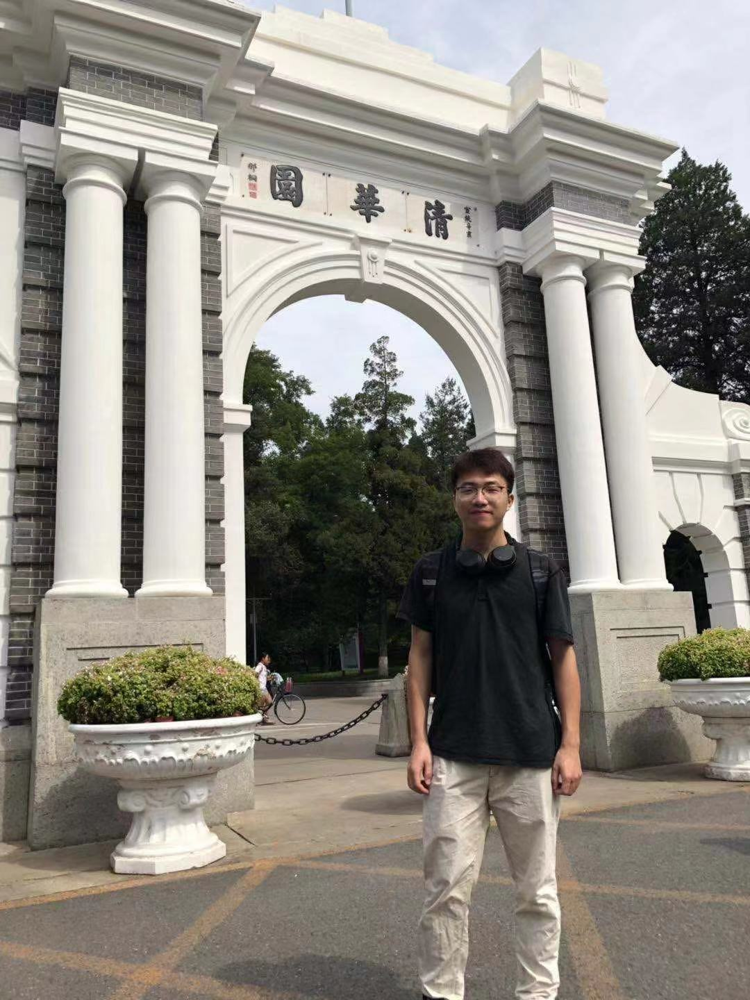

# 2019年年终总结

>岁月如梭，今天是2019年12月21日，再过10天就是2020年。还是得总结总结自己2019年的表现。如果满分100分的话，我给自己打个75分。

## 0. 序言

我将从三个方面（学习、工作、生活）对我的2019年进行总结。

## 1. 学习

### 1.1 学业方面

由于今年论文需要送到外省去审查加上自己没有用心写论文导致论文第一次盲审没过，说实话那时候还是蛮难受的。由于第一次盲审没过间接导致不能和小伙伴们拍毕业照，缺了些东西。

还是得感谢我导师贝老师、蔡老师，我师傅庆兵，还有陈曦师兄、小月月、邦邦巨佬、吕书记、旺平、书记、冲哥... 虽然我第二次盲审还是有点问题，但是最终我还是过了，顺利毕业！！！今年最主要的任务完成！

感谢 ZJU ！感谢周围的小伙伴以及老师、师傅、同事、亲人帮助。

### 1.2 专业技能学习

目前自己从事的是云计算相关工作，之前和室友说好叫他们监督我每周都得写一篇博客，但是看看自己的产出，羞愧羞愧！！！（自己罚钱好像蛮积极的，呃呃呃）

#### k8s: 

1. 自己订阅了磊哥的极客时间专栏，目前看了30几节吧，磊哥的课讲的很好，不过自己能力不足，还是得多看几遍（多看几遍就能简介明白）。

2. 自己买了2本kubernetes权威指南（一本是纪念版还有一本貌似是今年出的最新版本第四版），目前第四版已经看了200多页，相比之前对k8s理解更加深了一点，不过还是不行，得继续努力。

#### 数据结构与算法

数据结构与算法我觉得自己一直没有学好，说实话现在叫我直接写个快排、归并估计99.9%写不出来，目前订阅了极客时间的数据结构与算法之美，学了10多节，数据结构这东西还是得多coding，多刷题，多总结，练就对了。

#### go语言

go语言还是上手很快，语法比较简单，但是自己写代码的时候很多时候还得百度下怎么写。目前看过go语言的电子书：go圣经（很粗的看了下）、go语言实战（到协程那块）、极客时间的go语言感觉写的不是很通俗（目前看了6、7章）。go语言还是得学好，云计算领域go是绝对领导地位。

#### docker

说到docker学习，呃... 颜栎实在对不起，那本你推荐我的书没看下去，目前只看到第三章docker原理介绍，不太懂linux没学好... 对于docker而言目前只会一些简单操作：docker save 、load 、cp ....

#### 计算机网络

网络这东西，那时候一时激动订阅了极客时间的网络协议这一门课程，好长时间没看了，貌似就看了几节...惭愧，我知道网络真的很重要，但是自己还是只是懂一点皮毛。

#### 操作系统

我记得好像是读研的时候买了本鸟哥的linux，就翻了翻，目前好像还是新的，在工作中学了些基础的指令，还是不行。

#### 设计模式

设计模式的订阅是那时候看到出数据结构与算法之美的作者出的，因为觉得他的专栏蛮好的就订阅了，设计模式对于我来说还是相对比较高层次的，看是一定要看的只是时间问题。

## 2. 工作

### 2.1 工作内容

想了想工作快一年了自己学到了啥？有什么成长？

对k8s稍微了解点，go语言会那么一点，貌似就没了... 总之觉得代码写的太少了，实在是太少了... 是个大问题

### 2.2 同事

很庆幸我遇到的同事都很好，非常非常nice！我师傅庆兵、陈曦师兄、峰哥、涛哥、壮哥、颜栎、小王梓、汉波、林子哥、袁昊... 大家人都非常好，很庆幸能遇到你们，感谢你们的帮助关心！谢谢大家！

## 3. 生活

### 3.1 身体情况

1. 可能因为我司伙食比较好，还有长时间坐的原因，体重现在已经150可能150+了，呃呃呃...
2. 工作以后睡觉时间基本是1点后，其实还是自己原因，给自己敲一敲警钟！！！狗命第一呀！
3. 每周还是会有运动，不过现在身体的肉都是肥肉，精肉很少...

### 3.2 感情

感谢能遇到小月月，感谢小月月陪伴，虽然在异地。

### 3.3 旅游

呃，今年没有个人旅游过，伤心...

### 3.4 朋友同事关系

大家都很照顾我，非常感谢大家！！！

## 4. 意见&总结

### 4.1 生活方面

1. 多运动，肥肉太多啦
2. 早点休息，不要晚睡，12点差不多啦
3. 和小伙伴多联系下、多沟通

### 4.2 学习方面

1. 多看书，看好书，真正的把一本几本书吃透
2. 保持好奇心，多想、多问、多总结
3. 养成坚持写博客、多coding的好习惯

### 4.3 工作方面

1. 少抱怨，高效高质量完成工作
2. 工作时间少玩手机，提高效率
3. 多向大佬学习，多请教问题，浩神、壮哥、颜栎... 
4. 每周或每月写个总结

最后，感谢生命中的那些朋友，谢谢你们，愿你们永远身体健康，事事如意！！！加油，健文！

